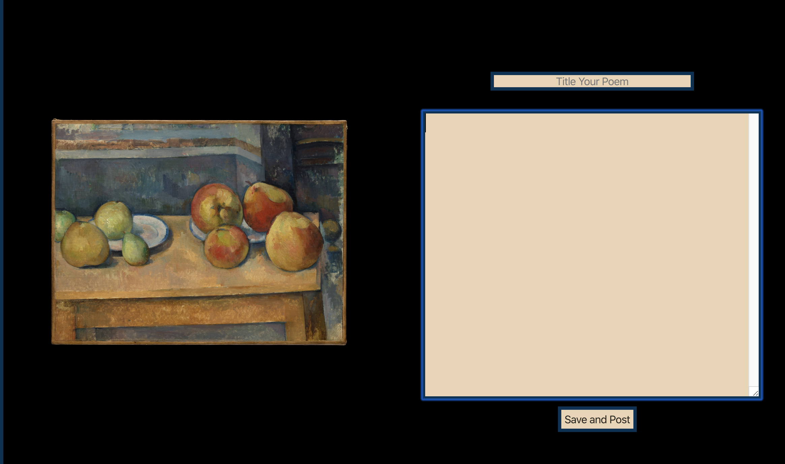

# Clickhole Scraper: The Bottomless Pit

# Project Features

1. [Overview](#Overview)
2. [Technology Used](#Technology-Used)
3. [Challenges](#Challenges)
4. [Final Thoughts](#Final-Thoughts)

## Overview

Art inspires art, in paint and in words. Picture Poetry is built at the intersection of poems and paintings. Users are prompted with a painting selected at random from the Metropolitan Museum of Art, and can then write a poem inspired by that painting, guided by whichever interpretation resonates with them. You can also browse the work of other picture poets, saving the works that you like best to you own collection. A fullstack MERN application with user Auth, this web app was diifficult yet deply rewarding to make. Picture Poetry is a long time passion project of mine, and I intend to continue to add to it over time so that other poets can find a place to enjoy fine art, inspiration, and the colorful poems that result.

Check out this project deployed to heroku [here](https://picturepoetry.herokuapp.com/)

## Technology-Used

- Node
- Express
- React
- Redux
- Mongoose
- MongoDB
- React-Router
- Express-Validator
- Bcrypt
- Jsonwebtoken
- Concurrently
- Axios

## Challenges

This project was at its most difficult in configuring the authentication flow, especially as this was my largest yet practical application of Redux in an app. The knowledge gained from overcoming these obstacles, however, has proved highly benefical in creating user friendly web apps that need complex auth flows with protected routes.

## Final-Thoughts

This project turned out different than originally visualized because each step brought a new batch of ideas I want to implement. Like a painting, a website always has room for more, and over the following months I hope to realize more and more of that vision.
